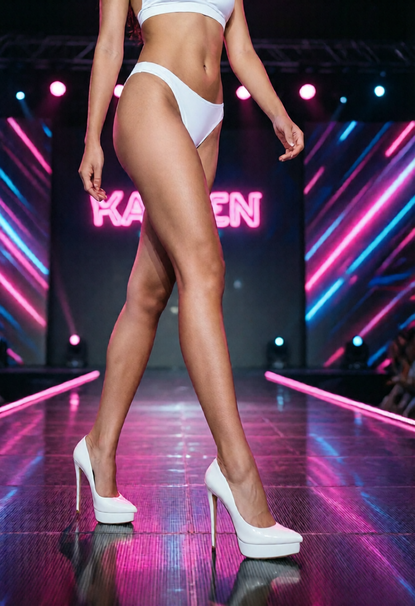

泰國是按摩愛好者的天堂。但「純」與「不純」之間，往往只有一線之隔。了解泰國按摩的分類，能讓你玩得更盡興且不踩雷。

### 💆 分類導覽

1.  **純式按摩 (Traditional Thai)**:
    - **推薦**: Health Land, Let's Relax 等連鎖店。
    - **體驗**: 正統筋絡放鬆，CP 值極高。
2.  **抓龍筋 (Health Prostate Massage)**:
    - **特色**: 針對男性生理功能的特殊按摩。
    - **推薦**: 選擇有認證的老牌店家，確保衛生與專業度。
3.  **肥皂按摩 (Soapy Massage / 浴室)**:
    - **特色**: 泰國夜生活最奢華的體驗之一。
    - **名店**: Maria, Emmanuelle, Long Beach。這裡的環境像五星級飯店，提供全方位的洗浴服務。

### ⚠️ 注意事項

- **小費文化**: 按摩結束後，建議給予師傅 50-100 泰銖的小費。
- **透明度**: 高級浴室通常有透明玻璃房（魚缸）供挑選，價格公開透明，不會有隱藏消費。

---

不論你是想要放鬆筋骨，還是想要極致享受，曼谷的按摩文化絕對能滿足你的所有需求！

---

### 📸 氛圍特寫：足尖的溫柔
在這場感官螺旋中，每一處細節都充滿了誘惑。

