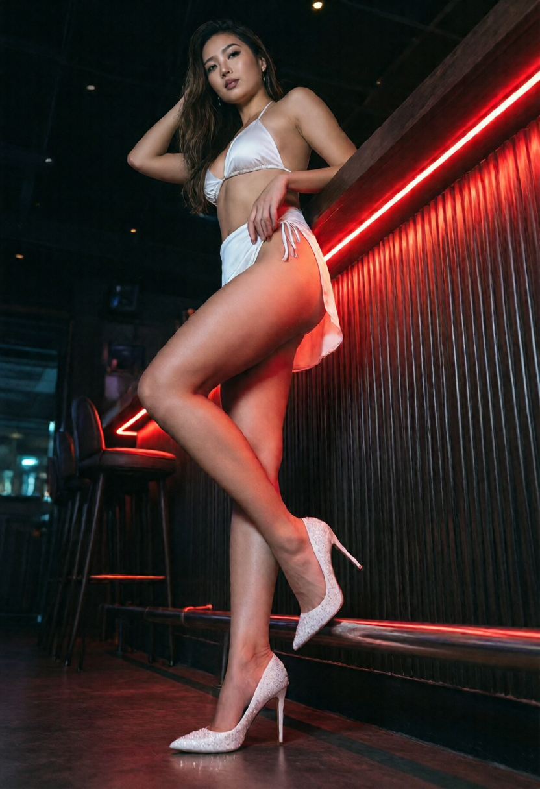

Soi Cowboy 是一條長約 150 公尺的小巷子，位於 Sukhumvit Soi 21 與 Soi 23 之間（捷運 Asok 站旁）。雖然巷子不長，但密集地分佈了超過 40 家 Go-Go Bar，是曼谷觀光客最愛打卡地點之一。

### 🏆 推薦店家

- **Baccara**: Soi Cowboy 的地標性店家。二樓有著名的透明玻璃地板，氣氛非常嗨，通常一位難求。
- **Crazy House**: 裝潢現代，音樂與表演都非常有張力，是這條巷子里非常有競爭力的店家。
- **Tilac**: 空間非常寬敞，有大型舞台和多個小舞台，適合想要輕鬆喝酒看表演的朋友。

### ⚠️ 避坑小提醒

1. **路邊拉客**: 巷子里常有拿著「Menu」拉客的人，建議直接走進你想去的店，不要理會路邊的小蜜蜂。
2. **門口拍照**: 大多數店家門口嚴禁拍照，請尊重當地規定，避免發生衝突。
3. **結帳檢查**: 雖然 Soi Cowboy 相對安全，但結帳時還是建議瞄一眼帳單金額是否正確。

---

### 📍 霓虹倒影中的魅力

